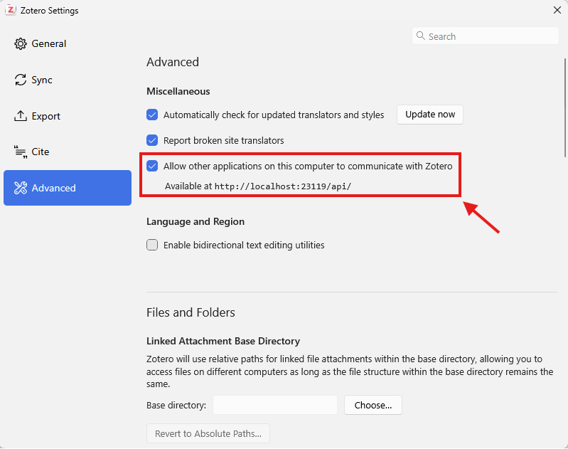

<!-- mcp-name: io.github.54yyyu/zotero-mcp -->

# Zotero MCP: Chat with your Research Library—Local or Web—in Claude, ChatGPT, ZCode, and more.

<p align="center">
  <a href="https://www.zotero.org/">
    
  </a>
  <a href="https://www.anthropic.com/claude">
    
  </a>
  <a href="https://chatgpt.com/">
    
  </a>
  <a href="https://modelcontextprotocol.io/introduction">
    
  </a>
  <a href="https://pypi.org/project/zotero-mcp-server/">
    
  </a>
  <a href="https://discord.gg/BvgjbcBUqg">
    
  </a>
  <a href="https://zcode.dev/">
    
  </a>
</p>

**Zotero MCP** seamlessly connects your [Zotero](https://www.zotero.org/) research library with [ChatGPT](https://openai.com), [Claude](https://www.anthropic.com/claude), [ZCode](https://zcode.dev/), and other AI assistants (e.g., [Cherry Studio](https://cherry-ai.com/), [Chorus](https://chorus.sh), [Cursor](https://www.cursor.com/)) via the [Model Context Protocol](https://modelcontextprotocol.io/introduction). Review papers, get summaries, analyze citations, extract PDF annotations, import astrophysics literature, and more!

> This fork adds **MinerU structured PDF reading** and **NASA ADS literature integration** on top of the original.

[中文文档 (Chinese README)](./README.zh-CN.md)

---

## ⌨️ Local Mode CLI Cheat Sheet

> **Why a separate section?** In local/hybrid mode the MCP `zotero_update_search_database` tool can time out at the client layer while the server-side job keeps running and holds an in-process lock — every subsequent tool call then fails with *"Another Zotero API operation is still in progress"*. Running these commands directly in your terminal avoids that entirely: no client timeout, no lock, and you get a live progress bar.

All commands below read `client_env` from `~/.config/zotero-mcp/config.json` automatically, so you do **not** need to prefix them with `ZOTERO_LOCAL=true ZOTERO_API_KEY=...` etc.

### Check status (no lock, safe to run anytime)

```bash
# Show vector DB stats: document count, last update time, embedding model,
# MinerU cache count, and whether the DB needs updating.
zotero-mcp db-status

# Inspect indexed documents — search by title/author, show aggregate stats,
# or peek at the first chars of stored document text. Useful for verifying
# that a specific paper is actually in the vector DB.
zotero-mcp db-inspect --stats
zotero-mcp db-inspect --filter "Spergel" --show-documents
```

### Update the vector database

```bash
# Metadata-only index (title, abstract, authors, tags). Fast — no PDF text.
# Use this when you don't need full-text semantic search.
zotero-mcp update-db

# Full-text index: extracts PDF text from your local Zotero storage and
# embeds it. This is the recommended command for local/hybrid mode.
# It is slow on the first run (minutes to hours for a large library) but
# subsequent runs skip items already up to date.
zotero-mcp update-db --fulltext

# Force a complete rebuild — deletes the existing collection and re-embeds
# EVERYTHING from scratch. Use only when you changed the embedding model
# (different vector dimensions), the chunk_size/overlap, or the DB is
# corrupted. This costs the most embedding API calls.
zotero-mcp update-db --fulltext --force-rebuild

# Re-embed specific items only (e.g. after editing metadata or replacing a
# PDF). Reuses MinerU '精读' cache when available. Much faster than a full
# scan because it skips the library walk.
zotero-mcp update-db --reindex-keys ABC12345,DEF67890

# Re-embed every paper you've ever '精读'd (read via zotero_read_pdf_pages).
# Idempotent — skips items already indexed from a valid MinerU cache.
# Use --force to bypass the idempotency guard (e.g. after changing
# chunk_size/overlap or the embedding model).
zotero-mcp update-db --reindex-cached-mineru
zotero-mcp update-db --reindex-cached-mineru --force
```

### When to run which command

| Situation | Command |
|-----------|---------|
| First time enabling semantic search | `update-db --fulltext` |
| Added/removed papers in Zotero | `update-db --fulltext` (skips up-to-date items) |
| Edited a paper's metadata or replaced its PDF | `update-db --reindex-keys <KEY>` |
| Want page-level search after 精读-ing papers | `update-db --reindex-cached-mineru` |
| Changed embedding model / chunk_size | `update-db --fulltext --force-rebuild` |
| Just want to check if DB needs updating | `db-status` (no write, no lock) |
| Vector DB seems inconsistent / corrupted | `update-db --fulltext --force-rebuild` |
| Want cheap async embeddings (OpenAI only) | `update-db --openai-batch`, then `openai-batch-status` / `openai-batch-import` |

### OpenAI Batch API (async, cheaper)

If you have a large library and want to save on embedding costs, submit the
batch asynchronously and import later:

```bash
zotero-mcp update-db --fulltext --openai-batch   # submit, returns immediately
zotero-mcp openai-batch-status                    # check progress
zotero-mcp openai-batch-import                    # import completed embeddings
```

> **⚠️ Never trigger `zotero_update_search_database` from an AI assistant in local mode.** The MCP client times out (~60s) while the server-side job keeps running and holds a process-wide lock, blocking all other tools. Run `zotero-mcp update-db --fulltext` in your terminal instead — you'll see a live progress bar and the lock won't wedge.

---

## ✨ Features

### 🧠 AI-Powered Semantic Search
- **Vector-based similarity search** over your entire research library (requires `[semantic]` extra)
- **Multiple embedding models**: Default (free, local), OpenAI, Gemini, and Ollama
- **Intelligent results** with similarity scores and contextual matching
- **Auto-updating database** with configurable sync schedules

### 🔍 Search Your Library
- Find papers, articles, and books by title, author, or content
- Perform complex searches with multiple criteria
- Browse collections, tags, and recent additions
- Semantic search for conceptual and topic-based discovery

### 📚 Access Your Content
- Retrieve detailed metadata for any item (markdown, BibTeX, or raw JSON export)
- Get full text content (when available)
- Look up items by BetterBibTeX citation key

### 📄 MinerU Structured PDF Reading (new `[mineru]` extra)
- **Extract formulas as LaTeX and tables as HTML** — impossible with plain PyMuPDF text-layer extraction
- When an LLM calls `zotero_read_pdf_pages` to read a paper, MinerU returns correct formulas like `$\text{Attention}(Q,K,V)=\text{softmax}(\frac{QK^T}{\sqrt{d_k}})V$`
- **MinerU cache → vector index**: after reading a paper once, `reindex_keys` builds a full-document vector index from MinerU's per-page text — with **page numbers in search results** and **no 20-chunk cap** (every page of a 500-page book is searchable). Enables "semantic search定位 → read_pdf_pages精读验证" workflow.
- One backend: `cloud` (mineru.net online API, recommended) — no local torch/ray dependency. The `api` (remote FastAPI) and local CLI (`hybrid`/`pipeline`) backends are disabled at the config layer; their code is retained for future re-enablement.
- Results cached per attachment key to avoid re-parsing
- Any failure silently falls back to PyMuPDF — no MinerU installed = 100% original behavior
- **Async first-parse**: on a cold cache, `zotero_read_pdf_pages` does NOT block on the multi-minute MinerU parse — it spawns a background task and returns a `task_id` (poll `zotero_get_batch_task_status`); the next call hits the cache instantly.

### 🔭 NASA ADS Astrophysics Literature (new)
- **`zotero_add_by_bibcode`**: import papers by bibcode — fetches ADS metadata, converts to a Zotero item, stores bibcode in the Extra field for dedup, and attempts OA PDF download (Unpaywall cascade + ADS link_gateway fallback)
- **`zotero_search_ads`**: fielded ADS search (e.g. `title:exoplanets`, `author:"Riess, A"`) with results tagged "in library ✓" / "not in library" (DOI + bibcode dual match)
- **`zotero_ads_citation_network`**: citation graph analysis — references (papers it cites) and citations (papers citing it), flagging high-impact gaps in your library
- Free token ([get one here](https://ui.adsabs.harvard.edu/#user/settings/token)), configured via `ADS_API_TOKEN` env var

### 📝 Work with Annotations
- Extract and search PDF annotations with page numbers
- Access Zotero's native annotations
- Create and update notes and annotations
- Extract PDF table of contents / outlines (requires `[pdf]` extra)

### ✏️ Write Operations
- **Add papers by DOI** with auto-fetched metadata and open-access PDF cascade (Unpaywall, arXiv, Semantic Scholar, PMC)
- **Add papers by URL** (arXiv, DOI links, generic webpages) or from local files
- Create and manage collections, update item metadata, batch-update tags
- Find and merge duplicate items with dry-run preview
- **Hybrid mode**: local reads + web API writes for local-mode users

### 📊 Scite Citation Intelligence (optional `[scite]` extra)
- **Citation tallies**: See how many papers support, contrast, or mention each item — the MCP version of the [Scite Zotero Plugin](https://github.com/scitedotai/scite-zotero-plugin)
- **Retraction alerts**: Scan your library for retracted or corrected papers
- No Scite account required — uses public API endpoints

### 🌐 Flexible Access Methods
- Local mode for offline access (no API key needed)
- Web API for cloud library access
- Hybrid mode: read from local Zotero, write via web API
- Direct WebDAV attachment downloads (e.g. for Nutstore/坚果云 sync)

### ⌨️ Standalone CLI (`zotero-cli`)
- Search, browse, and edit your library directly from the terminal — no AI assistant required
- Ideal for scripting, automation, and quick lookups
- `--json` on every command for pipelines and agents; short aliases (`s`, `g`, `ann`, `coll`) for interactive use

### 🪶 Agent skill — the same library for ~1% of the context

If your agent has shell access (Claude Code, Cursor, Codex, Windsurf, Gemini CLI, Amp, OpenCode …), one command teaches it to drive `zotero-cli` directly:

```bash
zotero-mcp install-skill
```

It detects the harnesses in your project and installs to each — no flags, no per-tool instructions to look up.

Why it matters: an MCP server sends **every tool's schema on every request**, before you type anything. The skill sits at 98 tokens until the agent decides it is relevant.

| Route | In context | Paid |
|---|---:|---|
| MCP server, default profile (38 tools) | **13,448** | every request |
| Agent skill, frontmatter only | **98** | always |
| Agent skill, body loaded | 1,368 | when it fires |

~137x cheaper before either is used, ~10x once the skill has fired. Re-measure any time with `python scripts/measure_context_cost.py`. This is the fixed context cost only — it does not measure task success or round trips, and a cheaper surface that gets the answer wrong is not cheaper. [Details below](#-agent-skill-one-command-for-any-harness).

Both routes work, and they share one config. Use the MCP server when your client speaks MCP but has no shell (Claude Desktop, ChatGPT); use the skill when it has a shell.

## 🚀 Quick Install

> **New to the command line?** Try the community-built [Zotero MCP Setup](https://github.com/ehawkin/zotero-mcp-setup) — includes a macOS GUI installer (DMG), one-click install scripts for Mac/Windows, and a step-by-step guide. No Terminal experience needed.

### Default Installation (core tools only)

The base install is lightweight — it includes search, metadata retrieval, annotations, and write operations. No ML/AI dependencies are pulled in.

```bash
# uv (recommended)
uv tool install zotero-mcp-server
zotero-mcp setup

# or pip
pip install zotero-mcp-server
zotero-mcp setup

# or pipx
pipx install zotero-mcp-server
zotero-mcp setup
```

### Optional Extras

Heavy ML/PDF dependencies are separated into optional extras so the base install stays fast and small:

| Extra | What it adds | Install command |
|-------|-------------|-----------------|
| `semantic` | Semantic search via ChromaDB, sentence-transformers, OpenAI/Gemini embeddings | `pip install "zotero-mcp-server[semantic]"` |
| `pdf` | PDF outline extraction (PyMuPDF) and EPUB annotation support | `pip install "zotero-mcp-server[pdf]"` |
| `mineru` | **MinerU structured reading** — formulas as LaTeX, tables as HTML | `pip install "zotero-mcp-server[mineru]"` |
| `scite` | [Scite](https://scite.ai) citation intelligence — tallies and retraction alerts (no account needed) | `pip install "zotero-mcp-server[scite]"` |
| `all` | Everything above | `pip install "zotero-mcp-server[all]"` |

> **ADS needs no extra**: NASA ADS integration only requires `requests` (already a core dep) — just set the `ADS_API_TOKEN` env var.
>
> **MinerU has zero local deps**: only the `cloud` backend (mineru.net online API) is supported, so zotero-mcp stays torch-free on the host. The `[mineru]` extra is no longer needed for the cloud path (it pulled the local `mineru[all]` package for the now-disabled local CLI backends).

```bash
# Full install with all features
uv tool install "zotero-mcp-server[all]"

# Just semantic search
uv tool install "zotero-mcp-server[semantic]"
```

If you only need basic library access (search, read, annotate, write), the default install with no extras is all you need.

#### Updating Your Installation

```bash
zotero-mcp update --check-only    # Check for updates
zotero-mcp update                 # Update to latest version (preserves all configurations)
```

## 🧠 Semantic Search

AI-powered semantic search lets you find research based on concepts and meaning, not just keywords.

### Setup

```bash
# Configure during initial setup (recommended)
zotero-mcp setup

# Or configure semantic search separately
zotero-mcp setup --semantic-config-only
```

**Available Embedding Models:**
- **Default (all-MiniLM-L6-v2)**: Free, runs locally, good for most use cases
- **OpenAI**: Better quality, requires API key (`text-embedding-3-small` or `text-embedding-3-large`)
- **Gemini**: Better quality, requires API key (`gemini-embedding-001`)
- **Ollama**: Runs locally via Ollama API (e.g., `qwen3-embedding`)

**Update Frequency Options:** Manual / Auto on startup / Daily / Every N days

### Using

```bash
zotero-mcp update-db                       # Build database (fast, metadata-only)
zotero-mcp update-db --fulltext            # With full-text extraction (slower, comprehensive)
zotero-mcp update-db --force-rebuild       # Force complete rebuild
zotero-mcp update-db --reindex-keys KEY1,KEY2  # Re-embed specific items (MinerU cache if available)
zotero-mcp update-db --reindex-cached-mineru   # Re-embed ALL 精读'd papers (idempotent)
zotero-mcp update-db --openai-batch        # Submit via OpenAI Batch API (cheaper, async)
zotero-mcp openai-batch-status             # Check batch status
zotero-mcp openai-batch-import             # Import completed batches
zotero-mcp db-status                       # Show database status (incl. MinerU cache progress)
```

**Example queries in your AI assistant:**
- *"Find research similar to machine learning concepts in neuroscience"*
- *"Papers that discuss climate change impacts on agriculture"*
- *"Find papers conceptually similar to this abstract: [paste abstract]"*

## 📄 MinerU Structured PDF Reading

When enabled, the `zotero_read_pdf_pages` tool returns structured Markdown — **formulas as LaTeX, tables as HTML** — far more accurate than PyMuPDF text-layer extraction.

### Setup

```bash
zotero-mcp setup   # the wizard asks whether to configure MinerU
```

The wizard configures the `cloud` backend (the only supported one):
- **`cloud`** (recommended, only supported): MinerU cloud API (mineru.net) — highest accuracy (vlm 95+), ~15s/paper, needs `cloud_token` from <https://mineru.net/apiManage/docs>

Two `semantic_search.embedding_config` keys tune the Ollama path for slower
hardware or very large libraries:

```jsonc
"embedding_config": {
  "model_name": "bge-m3",
  "timeout": 600,            // HTTP timeout per /api/embed call (default 120s)
  "request_batch_size": 64   // documents per request (default 64)
}
```

Raise `timeout` if indexing reports `Read timed out`; lower
`request_batch_size` to make each request cover less GPU work, which usually
fixes timeouts more reliably than raising the timeout alone.

When you choose OpenAI, setup also asks whether database updates should use
OpenAI Batch API. Batch updates are cheaper for large libraries, but they are
asynchronous: submit the batch, wait for completion, then import the embeddings.

The `api` (remote FastAPI) and local CLI (`hybrid`/`pipeline`) backends are **disabled at the config layer** — their code is retained in the module for future re-enablement but `is_mineru_available` returns False for them. Any failure falls back to PyMuPDF.

**Async first-parse.** On a cold cache, `zotero_read_pdf_pages` does NOT block on the multi-minute MinerU parse — it spawns a background task and returns a `task_id`. Poll `zotero_get_batch_task_status(task_id=...)` for progress; once `completed`, call `zotero_read_pdf_pages` again to get the structured content instantly (cache hit). For immediate content without waiting, set `mineru.enabled=false` to use the PyMuPDF fallback.

**No per-call page cap.** You may request the full document (`start_page=1, end_page=N`) in one call. The 50-page-per-call limit has been removed.

```json
// mineru block in ~/.config/zotero-mcp/config.json
{
  "mineru": {
    "enabled": true,
    "backend": "cloud",
    "cloud_token": "your-mineru-net-token",
    "cloud_model": "vlm",
    "timeout": 600,
    "cache_dir": "~/.cache/zotero-mcp/mineru"
  }
}
```

### Two extraction engines, one cache

| Scenario | Engine | Reason |
|----------|--------|--------|
| Semantic search (bulk, most items) | PyMuPDF / .zotero-ft-cache | Milliseconds; embeddings tolerate garbled formulas |
| Precise reading of one paper (LLM reads formulas/tables) | MinerU | Seconds–minutes, but formulas/tables are accurate |
| **Full-document vector index for a thick book** | **MinerU cache → reindex_keys** | MinerU's per-page text (with `\f` separators) gives accurate page numbers in search results + full chunking (no 20-chunk cap) |

MinerU results are cached per attachment key (`~/.cache/zotero-mcp/mineru/<key>/`) — only `.md` and split data are stored; MinerU's other byproducts (model JSON, layout PDFs, images) are discarded. Any failure silently falls back to PyMuPDF.

### MinerU-powered vector index (for long documents)

When you've read a paper or book via `zotero_read_pdf_pages` (triggering a MinerU parse), the per-page cache (`pages.json`) is available to the semantic-search build path. Running `zotero_update_search_database(reindex_keys=["ITEM_KEY"])` builds a **full-document vector index** from the MinerU text:

- **Page numbers in search results** — MinerU's per-page text is joined with form-feed separators, so `zotero_semantic_search` results include `p. N` in the Location field. The agent can then call `zotero_read_pdf_pages(item_key, start_page=N)` to精读 that exact page.
- **No 20-chunk cap** — a 500-page book produces ~800+ chunks, making every page searchable. Items without a MinerU cache keep the default 20-chunk limit.
- **Transparent fallback** — if no MinerU cache exists for an item, `reindex_keys` falls back to pdfminer as before.
- **Idempotent** — re-running `reindex_keys` skips items already indexed from a still-valid MinerU cache (no redundant embedding cost). Use `--force` to bypass and re-embed anyway (e.g. after changing `chunk_size`/`overlap` or the embedding model).

This enables a **"embedding定位 → MinerU精读验证"** workflow: semantic search finds the relevant page, then `read_pdf_pages` returns the structured Markdown (formulas as LaTeX) for that page — all from cache, instant.

```bash
# After reading a paper once (MinerU cache created):
zotero-mcp update-db --reindex-keys ITEM_KEY        # build MinerU-powered vector index

# Index ALL papers you've 精读'd in one call (idempotent — skips ones already done):
zotero-mcp update-db --reindex-cached-mineru

# Force re-embed even items already indexed from MinerU cache:
zotero-mcp update-db --reindex-cached-mineru --force

# See how many papers are cached / indexed / pending:
zotero-mcp db-status
```

`--reindex-cached-mineru` scans the MinerU cache directory for every paper you've 精读'd, reverse-maps attachment keys to parent item keys, and re-indexes only those not yet built from MinerU — so it's safe to run repeatedly.

## 🔭 NASA ADS Astrophysics Literature

Integrate NASA ADS (Astrophysics Data System) for literature search, import, and citation-graph analysis.

### Setup

1. Get a free API token at [ui.adsabs.harvard.edu](https://ui.adsabs.harvard.edu/#user/settings/token)
2. Run `zotero-mcp setup` — the wizard prompts for the token (hidden input via getpass, prevents shell-history leaks)
3. The token is written to the `ADS_API_TOKEN` env var, propagated to the MCP server by your client

### The three tools

**`zotero_add_by_bibcode`** — import by bibcode:
```
bibcode → ADS search API → structured fields → CSL-JSON → reuse existing batch pipeline
→ bibcode stored in Extra field → PDF cascade: ADS (PUB_PDF then EPRINT_PDF) → arXiv → Unpaywall → S2 → PMC
```

**`zotero_search_ads`** — fielded search:
```
query="title:exoplanets author:\"Riess, A\"" fq="property:refereed" sort="citation_count desc"
→ results tagged ✓in library / not in library
```

**`zotero_ads_citation_network`** — citation graph:
```
identifier="2003ApJ...589L..21B" direction="both"
→ references (outgoing) + citations (incoming)
→ each tagged in-library/not, summary: "Found N references, M citations, K already in library"
```

### Fault tolerance
- Token not configured → clear error message with signup link
- ADS unreachable / rate-limited → exponential backoff retry (2s/4s/8s), reads `X-RateLimit-Reset`
- PDF paywalled → silently skipped, import still succeeds (metadata without PDF)
- All third-party PDF URLs pass through SSRF guards (rejects private/loopback/cloud-metadata hosts, re-validates each redirect hop)

### PDF download cascade

When importing a paper with a DOI (via `add_by_doi`, `add_by_bibcode`, `add_by_bibtex`, `add_by_csl_json`), the server tries these PDF sources in order and stops at the first that yields a downloadable file:

1. **ADS link_gateway** (requires `ADS_API_TOKEN`) — prefers the publisher PDF (`PUB_PDF`) when `prefer_pub_pdf=True`, falling back to the arXiv preprint (`EPRINT_PDF`). In practice the publisher PDF is usually blocked by a WAF/captcha, so ADS effectively returns the arXiv preprint.
2. **arXiv** (via CrossRef relations — always open access)
3. **Unpaywall**
4. **Semantic Scholar**
5. **PubMed Central**

All sources return only a URL; the bytes are fetched through `_download_and_attach_pdf`, which applies the same SSRF guards (private-host rejection, per-redirect re-validation) to every source.

> **Note**: Sci-Hub was globally disabled and removed from the cascade. The `scihub_client` module is kept for reference but no longer wired in. For publisher PDFs blocked by WAFs, use `zotero_upgrade_preprint_pdfs_via_browser` with a live browser session.

### Browser-Session Publisher PDF Fetcher (optional)

When `zotero_upgrade_preprint_pdfs` (or the `pub_only` HTTP cascade) is blocked by publisher WAFs/captchas/403s, the browser-session fetcher can download the publisher PDF through a **live, already-authorized Chrome/Edge DevTools session**. The browser carries the user's real session cookies and institutional authorization, so the in-page `fetch()` looks like a normal navigation and bypasses the bot detection that blocks plain `requests.get`.

**Legal boundary**: this does NOT bypass paywalls, CAPTCHA, or institutional gates. You must manually sign in and pass any verification in the browser window before calling the tool. It only fetches PDFs you are already authorized to access.

**Install** (adds `websocket-client` for the DevTools protocol):

```bash
pip install "zotero-mcp-server[browser]"
```

**Configure** — add to `~/.config/zotero-mcp/config.json`:

```json
"browser_fetch": {
  "enabled": true,
  "debug_port": 9222,
  "page_wait_seconds": 8,
  "inter_item_sleep_seconds": 6
}
```

**Launch a dedicated Chrome session** (macOS):

```bash
bash scripts/launch_chrome_remote_debug_macos.sh \
  --direct-connection \
  --disable-extensions \
  --one-shot-profile \
  --remote-debugging-port 9222 \
  --url "https://www.sciencedirect.com/"
```

In the opened Chrome window:
1. Sign in to your institutional proxy / publisher (ScienceDirect, IEEE, Wiley, etc.)
2. Pass any bot-verification page manually
3. Open one article and click "View PDF" once
4. Keep the window open

**Call the tool**:

- *"Replace arXiv PDFs with publisher versions, using my browser session when HTTP is blocked"* → `zotero_upgrade_preprint_pdfs_via_browser`

The tool tries the HTTP cascade first (ADS PUB_PDF); only when that is blocked does it fall back to the browser session. Old PDFs are trashed only after a successful download (recoverable from Zotero's Trash). Poll with `zotero_get_batch_task_status`.

Adapted from [sciencedirect-live-session-fetcher](https://github.com/Given-Dream/sciencedirect-live-session-fetcher).

### Text Extraction Settings

PDFs are parsed with [pdf-inspector](https://github.com/firecrawl/pdf-inspector), which produces Markdown with the document's heading structure intact. These keys live under `semantic_search.extraction` in `~/.config/zotero-mcp/config.json`:

```json
{
  "semantic_search": {
    "extraction": {
      "pdf_max_pages": 50,
      "fulltext_display_max_pages": 10,
      "attachment_priority": ["markdown", "pdf", "html", "other"]
    }
  }
}
```

| Key | Default | What it does |
|---|---|---|
| `pdf_max_pages` | `50` | Pages extracted per PDF when indexing. Raising it does not widen what search sees on its own — that is bounded by the embedding model's token limit or `chunking.max_chunks_per_item`. |
| `fulltext_display_max_pages` | `10` | Pages returned by `zotero_get_item_fulltext`. Separate from the above because reading a paper is bounded by your assistant's context, not by recall. |
| `attachment_priority` | `["pdf", "html", "other"]` | Order in which attachment kinds are tried when an item has several readable files. |

**`attachment_priority`** exists for the case where you have converted a paper to clean Markdown yourself and attached it next to the original PDF. By default the PDF still wins; listing `"markdown"` first makes your converted copy the one that gets read and indexed. Valid entries are `pdf`, `html`, `markdown`, `text` and `other`. `other` is a catch-all matching every kind not named elsewhere in the list, so the default sweeps Markdown and plain text into one bucket where the larger file wins. Omitting `other` means anything unlisted is never chosen.

Changing this setting marks affected items for re-extraction, so a following `zotero-mcp update-db` refreshes text that came from a now-deprioritized attachment rather than leaving stale embeddings behind.

To read one specific attachment regardless of priority, pass that attachment's own key to `zotero_get_item_fulltext` (find it with `zotero_get_item_children`) — an attachment key bypasses the priority order and reads exactly that file.

## 🖥️ Setup & Usage

**Requirements**
- Python 3.10+
- Zotero 7+ (for local API with full-text access)
- An MCP-compatible client (e.g., Claude Desktop, ChatGPT Developer Mode, Cherry Studio, Chorus)

**For ChatGPT setup: see the [Getting Started guide](./docs/getting-started.md).**

### Configure Zotero

The Zotero local API must be enabled for the MCP server to work.

In Zotero 9, the local API toggle is under Settings → Advanced → 'Allow other applications on this computer to communicate with Zotero'.

Here is a screenshot:



### For Claude Desktop / Claude Code (MCP client)

#### Configuration

1. **Auto-configure** (recommended):
   ```bash
   zotero-mcp setup
   ```

2. **Manual configuration**:
   For Claude Desktop, add this to `claude_desktop_config.json`.
   For Claude Code, add this to `~/.claude.json`:
   ```json
   {
     "mcpServers": {
       "zotero": {
         "command": "zotero-mcp",
         "env": {
           "ZOTERO_LOCAL": "true",
           "ZOTERO_API_KEY": "YOUR_API_KEY",
           "ZOTERO_LIBRARY_ID": "YOUR_LIBRARY_ID",
           "ADS_API_TOKEN": "YOUR_ADS_TOKEN (optional)"
         }
       }
     }
   }
   ```

   For **local read-only use**, `ZOTERO_LOCAL: "true"` is all you need — drop the `ZOTERO_API_KEY` and `ZOTERO_LIBRARY_ID` lines entirely.

   The local API is fast but read-only, so the MCP server uses the Zotero web API for write operations.

   To enable **write mode**:
   - Keep `ZOTERO_LOCAL: "true"` — with API credentials set, the server runs in hybrid mode (fast local reads, web API writes)
   - Click [here](https://www.zotero.org/settings/security#applications) to generate a Zotero API key and replace `YOUR_API_KEY` with it
   - `ZOTERO_LIBRARY_ID` is your numeric **userID**, shown on that same page (for a group library, use the group's ID and also set `ZOTERO_LIBRARY_TYPE: "group"`).

   > **Important Note**: Environmental variables set in the shell you run `claude` in will override these values.

   > **Tip:** If Claude Desktop reports it can't find the `zotero-mcp` command, use the
   > absolute path instead (run `zotero-mcp setup-info` or `which zotero-mcp` to find it) —
   > GUI apps don't always inherit your shell `PATH`.

#### Usage

1. Start Zotero desktop (make sure local API is enabled in preferences)
2. Launch Claude Desktop / Claude Code
3. For Claude Desktop, access the Zotero-MCP tool through Claude Desktop's tools interface.
For Claude Code, run the `/mcp` command, and make sure the Zotero MCP server is connected.

Example prompts:
- "Search my library for papers on machine learning"
- "Find recent articles I've added about climate change"
- "Summarize the key findings from my paper on quantum computing"
- "Extract all PDF annotations from my paper on neural networks"
- "Search my notes and annotations for mentions of 'reinforcement learning'"
- "Show me papers tagged '#Arm' excluding those with '#Crypt' in my library"
- "Search for papers on operating system with tag '#Arm'"
- "Export the BibTeX citation for papers on machine learning"
- **"Find papers conceptually similar to deep learning in computer vision"** *(semantic search)*
- **"Research that relates to the intersection of AI and healthcare"** *(semantic search)*
- **"Papers that discuss topics similar to this abstract: [paste text]"** *(semantic search)*

### For Autohand Code

After installing Zotero MCP, add a local read-only server with:

```bash
autohand mcp add zotero env ZOTERO_LOCAL=true zotero-mcp
```

Add `--scope project` after `add` to keep the server configuration in the current project. For hybrid or web API access, add the credentials described above to the `env` command. See [Autohand Code](https://github.com/autohandai/code-cli/) for current installation and CLI details.

### For Cherry Studio

Go to Settings → MCP Servers → Edit MCP Configuration:

```json
{
  "mcpServers": {
    "zotero": {
      "name": "zotero",
      "type": "stdio",
      "isActive": true,
      "command": "zotero-mcp",
      "args": [],
      "env": {
        "ZOTERO_LOCAL": "true"
      }
    }
  }
}
```

### For ZCode, Claude Code, or any MCP client (complete setup)

This section walks through a **complete production setup** that combines local Zotero access, web-API write mode, NASA ADS, semantic search (embedding + reranker), and MinerU structured PDF reading — all in one configuration.

#### Step 1: Install and run setup wizard

```bash
# Clone and install (editable, so code changes take effect immediately)
git clone https://github.com/your-fork/zotero-mcp.git
cd zotero-mcp
uv pip install -e ".[all]"   # or: pip install -e ".[all]"

# Run the interactive setup wizard (configures Zotero, semantic search, MinerU, ADS)
zotero-mcp setup
```

The wizard writes `~/.config/zotero-mcp/config.json` (permissions 600). You can also edit it manually — see the complete example below.

#### Step 2: Configure your MCP client

Add `zotero-mcp` as a stdio MCP server. The `command` should be the absolute path to the `zotero-mcp` executable (run `which zotero-mcp` to find it — GUI apps don't always inherit your shell `PATH`).

```json
{
  "zotero": {
    "type": "stdio",
    "command": "/absolute/path/to/zotero-mcp",
    "args": ["serve", "--transport", "stdio"],
    "env": {
      "ZOTERO_LOCAL": "true",
      "ZOTERO_API_KEY": "your-zotero-api-key",
      "ZOTERO_LIBRARY_ID": "your-numeric-user-id",
      "ZOTERO_LIBRARY_TYPE": "user",
      "ADS_API_TOKEN": "your-ads-api-token",
      "ZOTERO_MCP_LOG_LEVEL": "WARNING"
    }
  }
}
```

| Env var | Required? | Purpose |
|---|---|---|
| `ZOTERO_LOCAL` | ✅ | `true` = read via fast local API (Zotero desktop must be running) |
| `ZOTERO_API_KEY` | for writes | Local API is read-only; web API handles writes (import/edit/delete) |
| `ZOTERO_LIBRARY_ID` | for writes | Your numeric userID (zotero.org/settings/security) |
| `ZOTERO_LIBRARY_TYPE` | optional | `user` (default) or `group` |
| `ADS_API_TOKEN` | for ADS | Free token from <https://ui.adsabs.harvard.edu/#user/settings/token> |
| `ZOTERO_MCP_LOG_LEVEL` | optional | `WARNING` (default), `INFO`, or `DEBUG` |

> **One install, many clients**: because `zotero-mcp` is installed once (editable mode), the same `command` path works for ZCode, Claude Code, Claude Desktop, Cherry Studio, etc. Each client forks its own `zotero-mcp` process, but all run the same code. Changing `src/*.py` and restarting the client is enough — no reinstall needed.

#### Step 3: Configure semantic search (embedding + reranker)

Edit `~/.config/zotero-mcp/config.json` and set the `semantic_search` block. You can use a **local model server** (oMLX, Ollama) or a **cloud API** (zenmux, OpenAI, Google):

```jsonc
{
  "semantic_search": {
    "embedding_model": "openai",
    "embedding_config": {
      "model_name": "openai/text-embedding-3-large",
      "api_key": "your-api-key",
      "base_url": "https://zenmux.ai/api/v1",
      "request_batch_size": 64,
      "rate_limit_rps": 10,
      "dimensions": 1024
    },
    "chunking": {
      "enabled": true,
      "chunk_size": 1500,
      "overlap": 200,
      "max_chunks_per_item": 20
    },
    "reranker": {
      "enabled": true,
      "type": "api",
      "model": "qwen/qwen3-rerank",
      "api_key": "your-api-key",
      "base_url": "https://zenmux.ai/api/v1",
      "request_format": "nested",
      "candidate_multiplier": 3
    },
    "update_config": {
      "auto_update": false,
      "update_frequency": "manual"
    }
  }
}
```

**Embedding provider options** (set `embedding_model` + `embedding_config`):

| Provider | `embedding_model` | `base_url` | Notes |
|---|---|---|---|
| zenmux (cloud) | `"openai"` | `https://zenmux.ai/api/v1` | OpenAI-compatible; ~$3 to index 1000+ papers |
| OpenAI (cloud) | `"openai"` | (omit, uses default) | `text-embedding-3-small` default |
| oMLX (local, Apple Silicon) | `"openai"` | `http://localhost:8000/v1` | Free but slow with 8B models |
| Gemini (cloud) | `"gemini"` | — | Uses `GEMINI_API_KEY` |
| HuggingFace (local) | `"qwen"` or any HF model name | — | Runs in-process via sentence-transformers |
| Ollama (local) | `"ollama"` | `http://localhost:11434` | `OLLAMA_BASE_URL` |
| ChromaDB default | `"default"` | — | `all-MiniLM-L6-v2`, zero config, 256-token cap |

**`dimensions` (optional)** — Matryoshka dimension reduction for `text-embedding-3-large/small`. When set, the API returns shorter vectors with near-lossless semantic quality (MTEB 64.6 @1024 vs 64.6 @3072 for `text-embedding-3-large`), dramatically reducing ChromaDB storage (~67% at 1024 vs 3072). Omit the field to use the model's default full dimensionality. Requires a `force_full_rebuild` to apply (the dimension probe auto-detects the mismatch and resets the collection). Not supported by Gemini/Ollama/HF embedding functions.

**Reranker options** (set `reranker.type`):

| Type | How it works | Config |
|---|---|---|
| `"api"` (cloud/local HTTP) | Calls a `/v1/rerank` endpoint (zenmux, oMLX, Jina) | `base_url` + `api_key` + `request_format` |
| `"local"` (default) | Loads a HuggingFace CrossEncoder in-process | `model`: e.g. `cross-encoder/ms-marco-MiniLM-L-6-v2` |

> **Request format**: `"flat"` (default, oMLX/Jina/Cohere-style: top-level `query`/`documents`) or `"nested"` (zenmux-style: `input.{query,documents}` + `parameters`). If unsure, try `"flat"` first; a 400 error asking for `input.query` means you need `"nested"`.

> **Reranker failure is non-fatal**: if the reranker endpoint is down, search automatically falls back to vector-order results (with a warning log). Semantic search never breaks because of the reranker.

#### Step 4: Configure MinerU structured PDF reading (optional)

MinerU gives `zotero_read_pdf_pages` accurate formulas (LaTeX) and tables (HTML) instead of PyMuPDF's garbled text-layer output. Only the `cloud` backend is supported:

```jsonc
{
  "mineru": {
    "enabled": true,
    "backend": "cloud",
    "cloud_token": "your-mineru-net-token",
    "cloud_model": "vlm",
    "timeout": 600
  }
}
```

| Backend | Speed | Accuracy | Requires |
|---|---|---|---|
| `"cloud"` (only supported) | ~15s/paper | highest (vlm 95+) | `cloud_token` from <https://mineru.net/apiManage/docs> |

The `api` (remote FastAPI) and local CLI (`hybrid`/`pipeline`) backends are **disabled at the config layer** — their code is retained for future re-enablement but `is_mineru_available` returns False for them. Any failure falls back to PyMuPDF.

**Async first-parse**: on a cold cache, `zotero_read_pdf_pages` spawns a background task and returns a `task_id` instead of blocking on the multi-minute parse. Poll `zotero_get_batch_task_status(task_id=...)`; once `completed`, call `zotero_read_pdf_pages` again for instant structured content (cache hit).

> **Caching**: MinerU results are cached at `~/.cache/zotero-mcp/mineru/<attachment_key>/` (only `fulltext.md` + `pages.json` + `meta.json`, ~50KB per paper). First read of a paper triggers a background full parse; subsequent reads of any page hit the cache in <0.1s. Cache invalidates on PDF size change.

#### Step 5: Build the semantic search index

After configuring embedding, build the vector index (required before semantic search works):

```bash
# Full build (indexes all papers — takes minutes to hours depending on provider)
zotero-mcp update-db

# Check status
zotero-mcp status

# Force rebuild (switching embedding model requires this)
zotero-mcp update-db --force-rebuild
```

**Storage**: the ChromaDB vector index lives at `~/.config/zotero-mcp/chroma_db/` (~2-3GB for 1000+ papers with 3072-dim embeddings). Full-text extraction uses Zotero's own `.zotero-ft-cache` when available (no re-extraction needed).

#### Step 6: Use it in your MCP client

Start Zotero desktop (for local API), then launch your MCP client. Try these:

- *"Search my library for papers on globular clusters"* → `zotero_search_items` / `zotero_semantic_search`
- *"Read page 4 of [paper] and explain the formula"* → `zotero_read_pdf_pages` (MinerU returns correct LaTeX)
- *"Search ADS for dark energy surveys, then import the top 3"* → `zotero_search_ads` + `zotero_add_by_bibcode`
- *"What papers does this cite that I don't have?"* → `zotero_ads_citation_network`
- *"Move all papers tagged 'survey' into the 'surveys' collection"* → `zotero_batch_update_tags` + `zotero_manage_collections`

#### Complete `config.json` example

```jsonc
{
  "semantic_search": {
    "embedding_model": "openai",
    "embedding_config": {
      "model_name": "openai/text-embedding-3-large",
      "api_key": "your-zenmux-or-openai-key",
      "base_url": "https://zenmux.ai/api/v1",
      "request_batch_size": 64,
      "rate_limit_rps": 10,
      "dimensions": 1024
    },
    "include_fulltext": true,
    "zotero_db_path": "/Users/you/Documents/Zotero/zotero.sqlite",
    "chunking": { "enabled": true, "chunk_size": 1500, "overlap": 200, "max_chunks_per_item": 20 },
    "reranker": {
      "enabled": true, "type": "api", "model": "qwen/qwen3-rerank",
      "api_key": "your-key", "base_url": "https://zenmux.ai/api/v1",
      "request_format": "nested", "candidate_multiplier": 3
    },
    "update_config": { "auto_update": false, "update_frequency": "manual" }
  },
  "mineru": {
    "enabled": true, "backend": "cloud", "cloud_token": "your-mineru-token",
    "cloud_model": "vlm", "timeout": 600
  },
  "browser_fetch": {
    "enabled": false,
    "debug_port": 9222,
    "page_wait_seconds": 8,
    "inter_item_sleep_seconds": 6
  },
  "client_env": {
    "ZOTERO_LOCAL": "true",
    "ZOTERO_API_KEY": "your-zotero-key",
    "ZOTERO_LIBRARY_ID": "1234567",
    "ADS_API_TOKEN": "your-ads-token"
  }
}
```

> **Security**: `config.json` holds API keys and is covered by `.gitignore` (any path). It is never committed. The file is created with `chmod 600`. If a key is accidentally exposed, regenerate it at the provider's dashboard.

## 🔧 Advanced Configuration

### WebDAV Attachment Storage

If your Zotero syncs PDF attachments via WebDAV (e.g. Nutstore/坚果云), configure these env vars so the server can download attachments directly from WebDAV (a fallback when the local API is unavailable):

```bash
ZOTERO_WEBDAV_URL=https://dav.jianguoyun.com/dav/
ZOTERO_WEBDAV_USERNAME=your_account
ZOTERO_WEBDAV_PASSWORD=app_password   # Nutstore uses an "app password", not your login password
```

> **Note:** organizing/classifying (collection membership) only touches Zotero metadata and is **completely unaffected by WebDAV**. Only PDF-reading features (read_pdf_pages, annotation extraction, semantic-search fulltext indexing) may be affected — with WebDAV configured, they automatically pull files from the cloud.

### Environment Variables

**Zotero Connection:**
- `ZOTERO_LOCAL=true`: Use the local Zotero API (default: false)
- `ZOTERO_API_KEY`: Your Zotero API key (for web API)
- `ZOTERO_LIBRARY_ID`: Your Zotero library ID (for web API)
- `ZOTERO_LIBRARY_TYPE`: Library type (user or group, default: user)
- `ZOTERO_WEBDAV_URL` / `ZOTERO_WEBDAV_USERNAME` / `ZOTERO_WEBDAV_PASSWORD`: WebDAV attachment storage (optional)

**Semantic Search:**
- `ZOTERO_EMBEDDING_MODEL`: Embedding model to use (default, openai, gemini, ollama)
- `OPENAI_API_KEY`: Your OpenAI API key (for OpenAI embeddings)
- `OPENAI_EMBEDDING_MODEL`: OpenAI model name (text-embedding-3-small, text-embedding-3-large)
- `OPENAI_BASE_URL`: Custom OpenAI endpoint URL (optional, for use with compatible APIs)
- OpenAI Batch API indexing is configured by `zotero-mcp setup` and can be overridden with
  `zotero-mcp update-db --openai-batch` or `--no-openai-batch`
- `GEMINI_API_KEY`: Your Gemini API key (for Gemini embeddings)
- `GEMINI_EMBEDDING_MODEL`: Gemini model name (gemini-embedding-001)
- `GEMINI_BASE_URL`: Custom Gemini endpoint URL (optional, for use with compatible APIs)
- `OLLAMA_EMBEDDING_MODEL`: Ollama embedding model name (qwen3-embedding by default)
- `OLLAMA_BASE_URL`: Ollama server URL (default: http://localhost:11434)
- `ZOTERO_DB_PATH`: Custom `zotero.sqlite` path (optional). When unset, the
  database is located automatically: a data directory configured in Zotero's
  preferences (read from the profile's `prefs.js`) is tried first, then the
  default `~/Zotero` location.

**Search backend:**
- `ZOTERO_SEARCH_BACKEND=sqlite`: Route `zotero_search_items` and
  `zotero_advanced_search` through direct SQL against `zotero.sqlite` instead of
  fetching over the API and filtering in Python (default: `api`). Requires
  `ZOTERO_LOCAL=true`, since it reads the database off disk. Substantially
  faster on large libraries — an `advanced_search` that pages the whole library
  over the API drops from minutes to well under a second. Any query the backend
  doesn't cover falls back to the API path automatically, so the results are
  either the same or better, never worse.

**Global search across libraries:**

With the SQLite backend enabled, `zotero_search_items`, `zotero_advanced_search`
and `zotero_semantic_search` accept `search_all_libraries=True` (`--all-libraries`
on the CLI). One query then covers your personal library and every group library
at once, and each result is labelled with the library it came from:

```
**Library:** AI in entrepreneurship (groupID=6015547)
```

This is deliberately gated on `ZOTERO_SEARCH_BACKEND=sqlite`. The Zotero API can
only search one library per request, so without direct SQL the best anyone could
do is replay a single-library search against each library in turn — a different
and far slower operation. Rather than emulate global search badly, the tools
refuse and say so.

Two limits follow from how Zotero stores things. **Collections are per-library**
(`collections.libraryID` is NOT NULL), so `collection_key` and `collection`
conditions cannot be combined with a global search. **Tags are not** — Zotero
keeps one database-wide `tags` table shared by every library — so tag filters and
`tag` conditions work globally and are the recommended way to slice a global
search.

Duplicates across libraries are returned as-is: the same paper filed in two
libraries is two items, and collapsing them would hide where each copy lives.

**Tool surface:**
- `ZOTERO_MCP_TOOLSETS`: Which optional tool groups to expose. Every tool the
  server registers is sent to the model on *every* request, so the tool list is
  a fixed cost on your context window. Groups that need an external service,
  serve maintenance rather than research, or apply only to some users are off
  by default. See [Tool Groups](#-tool-groups) below.

**Item schema:**
- `ZOTERO_MCP_SCHEMA_REFRESH=0`: Disable the weekly background refresh of
  Zotero's item-type schema from `api.zotero.org`. The schema is what routes a
  generic `title=` update to the field a type actually stores it under (a
  statute's `nameOfAct`, a case's `caseName`). A copy ships with the package, so
  disabling the refresh only means new item types added by Zotero after this
  release won't be picked up until you upgrade. `zotero-mcp schema-refresh`
  still refreshes on demand.
- `ZOTERO_MCP_SCHEMA_CACHE`: Custom path for the refreshed schema cache
  (default: `~/.cache/zotero-mcp/schema.json`).

**NASA ADS (astrophysics literature):**
- `ADS_API_TOKEN`: NASA ADS API token ([get one free](https://ui.adsabs.harvard.edu/#user/settings/token))

**MinerU (structured reading):**
- Configured via the `zotero-mcp setup` wizard, stored in the `mineru` block of `~/.config/zotero-mcp/config.json`

### Command-Line Options

```bash
zotero-mcp serve                              # Run the server
zotero-mcp serve --transport stdio|streamable-http|sse
zotero-mcp setup                              # Interactive setup
zotero-mcp setup --semantic-config-only       # Configure only semantic search
zotero-mcp setup-info                         # Show install path and config info
zotero-mcp update                             # Update to latest version
zotero-mcp update --check-only                # Check for updates without installing
zotero-mcp update-db                          # Update semantic search database
zotero-mcp update-db --fulltext --force-rebuild
zotero-mcp db-status                          # Show database status
zotero-mcp version
```

## 🐳 Docker Images (GHCR)

This repository publishes multi-arch container images to GitHub Container Registry:

- `ghcr.io/<owner>/zotero-mcp:<tag>-core` - lightweight install (no optional extras)
- `ghcr.io/<owner>/zotero-mcp:<tag>-all` - full install with `[semantic,pdf,scite]`
- Unsuffixed tags (for example `:latest`, `:vX.Y.Z`) point to the `all` flavor

Detailed publishing and runtime notes are in `docs/docker-images.md`.

Tag strategy:

- Release tags: `vX.Y.Z`, `vX.Y`, `vX` (plus `-core` and `-all` variants)
- Main branch: `latest` (plus `latest-core` and `latest-all`)
- Immutable SHA tags: `sha-<shortsha>-core`, `sha-<shortsha>-all` (and unsuffixed SHA for `all`)

### Runtime modes in the container

The image supports both MCP server and standalone CLI modes.

- **Server mode (default)**: runs `zotero-mcp serve --transport stdio`
- **CLI mode**: set `ZOTERO_APP=cli` and pass normal `zotero-cli` arguments

### Docker env vars and persistence

- Container runtime vars: `ZOTERO_APP` (`server` or `cli`) and `ZOTERO_TRANSPORT` (default: `stdio`)
- All standard Zotero MCP vars are supported in containers (`ZOTERO_LOCAL`, `ZOTERO_API_KEY`, `ZOTERO_LIBRARY_ID`, embedding provider keys, etc.)
- ChromaDB persistence path in the container is `/home/app/.config/zotero-mcp/chroma_db/`
- Persist config + ChromaDB by mounting `/home/app/.config/zotero-mcp`

Examples:

```bash
# Default MCP server mode (stdio)
docker run --rm ghcr.io/<owner>/zotero-mcp:latest

# MCP server mode with explicit transport
docker run --rm ghcr.io/<owner>/zotero-mcp:latest serve --transport streamable-http --host 0.0.0.0 --port 8000

# Standalone CLI mode
docker run --rm -e ZOTERO_APP=cli ghcr.io/<owner>/zotero-mcp:latest search "machine learning"

# Persist config + ChromaDB across runs
docker run --rm -v zotero-mcp-data:/home/app/.config/zotero-mcp --env-file .env ghcr.io/<owner>/zotero-mcp:latest
```

## ⌨️ CLI Mode (`zotero-cli`)

`zotero-cli` is a standalone terminal interface to your Zotero library. It uses the same tools as the MCP server but without needing an AI assistant — useful for quick lookups, shell scripts, and automation.

Use `zotero-mcp` when your AI client supports MCP (Claude Desktop, ChatGPT). Use `zotero-cli` for shell scripts, cron jobs, or agentic pipelines with shell access (e.g. Claude Code) — CLI commands cost far fewer tokens than MCP tool schemas and compose naturally with Unix pipes.

Both share the same configuration set up by `zotero-mcp setup`.

### How much context each route costs

The MCP server sends every enabled tool's name, description and JSON parameter schema to the model on **every request**, before you type anything. The CLI route puts only a skill description in context until the model decides it is relevant. Measured on this repo with `python scripts/measure_context_cost.py`:

| Route | Tokens in context | When it is paid |
|---|---:|---|
| MCP, default profile (38 tools) | 13,448 | every request |
| MCP, `ZOTERO_MCP_TOOLSETS=none` (32 tools) | 11,761 | every request |
| MCP, `ZOTERO_MCP_TOOLSETS=all` (50 tools) | 17,414 | every request |
| CLI skill, frontmatter only | 98 | always |
| CLI skill, body loaded | 1,368 | once the skill fires |
| CLI skill + full command reference | 4,389 | worst case |

That is the *fixed* cost only. It does not measure task success, output size, or how many round trips each route takes to finish a job — a cheaper surface that gets the answer wrong is not cheaper. Numbers are `cl100k_base` tokens and are re-measured, not estimated; `tests/test_context_cost_claim.py` fails if the relationship stops holding.

### 🪶 Agent skill: one command for any harness

```bash
zotero-mcp install-skill
```

Run it in your project. It detects which agent harnesses are set up there and installs to each one, in that harness's own format:

| Harness | Detected by | Installs |
|---|---|---|
| Claude Code (project) | `.claude/` | `.claude/skills/zotero-cli/` |
| Claude Code (user) | `~/.claude/` | `~/.claude/skills/zotero-cli/` |
| Cursor | `.cursor/` | `.cursor/rules/zotero-cli.mdc` |
| Windsurf | `.windsurf/` | `.windsurf/rules/zotero-cli.md` |
| Codex, Amp, OpenCode, Jules … | `AGENTS.md` | a pointer block in `AGENTS.md` |
| Gemini CLI | `GEMINI.md` or `.gemini/` | a pointer block in `GEMINI.md` |

```bash
zotero-mcp install-skill --list-targets      # what is detected here
zotero-mcp install-skill --target cursor     # install one explicitly
zotero-mcp install-skill --force             # overwrite an existing copy
```

**It will not overwrite your work.** A destination that exists and differs is reported, not replaced, unless you pass `--force`. For shared instruction files it is stricter: only the text between the `zotero-cli` markers is ever managed, so the rest of your `AGENTS.md` is untouchable by construction — re-running updates that block in place rather than appending a second one.

**It keeps the context advantage.** Shared instruction files get a short pointer block, not the whole skill; the body lands beside it and the agent opens it only when it decides Zotero is relevant. Pasting 1,400 tokens into every agent's always-loaded context would spend exactly the advantage this exists for.

The skill teaches the find-keys-then-act loop, `--json`, how to pick among the six search modes, paging, reading a PDF by outline-then-page-range rather than whole, and when an empty result means "the index is not built" rather than "you have no papers on that".

### Machine-readable output (`--json`)

Every command accepts `--json`, before or after the command name. Output is one object per invocation:

```bash
zotero-cli --json search "attention" --limit 5 --detail keys_only
# {"ok": true, "command": "search", "schema": 1, "data": {"count": 5, "items": [...]}}
```

Success carries `data`; failure carries `error.message` and a stable `error.code`, also on stdout, so one stream carries both outcomes. Read commands (search, get, annotations list, notes list, config) return real structure; commands whose answer is a status line return `{"text": ...}`. Run `zotero-cli --json-schema` for the full contract.

```bash
# Item keys are the currency of every command — pipe them onward
zotero-cli --json search "diffusion models" --limit 5 --detail keys_only \
  | jq -r '.data.items[].key' \
  | while read -r key; do zotero-cli --json get metadata "$key"; done
```

### Quick reference

```bash
zotero-cli search "machine learning"          # keyword search
zotero-cli s "neural networks" --limit 5      # short alias + limit
zotero-cli search --mode semantic "attention mechanisms"
zotero-cli g metadata ABC123 --format bibtex  # BibTeX export
zotero-cli get fulltext ABC123                 # full text
zotero-cli get children ABC123                 # attachments and notes

# Edit item metadata
zotero-cli edit ABC123 --title "New Title"
zotero-cli edit ABC123 --add-tags "reviewed,important" --date "2024"

# Notes and annotations
zotero-cli notes list ABC123
zotero-cli notes create --item-key ABC123 --text "My note" --tags "idea"
zotero-cli notes create --item-key ABC123 --text -   # read from stdin
zotero-cli ann list --item-key ABC123         # annotations (short alias)
zotero-cli ann list --item-key ABC123 --format json  # structured export
zotero-cli ann search "highlight text"

# Add items
zotero-cli add doi 10.1038/s41586-021-03819-2
zotero-cli add url https://arxiv.org/abs/2301.00001
zotero-cli add file --filepath /path/to/paper.pdf --title "Override Title"
zotero-cli add isbn 9780262046305
zotero-cli add bibtex --file refs.bib                # or --bibtex '@article{...}'
zotero-cli add bibtex --bibtex - < refs.bib          # stdin via -
zotero-cli add csl-json --file refs.json             # or --json '...' / --json -

# --collections accepts keys, names, or parent/child paths — resolved and
# validated before the item is created (a typo fails the add, with suggestions,
# instead of leaving an unfiled item)
zotero-cli add doi 10.1038/s41586-021-03819-2 --collections "Reading List"
zotero-cli collections manage --item-keys ABC123 --add-to "_project/topic"

# Adds are idempotent by default (--if-exists file): if the item is already in
# the library it is reused — filed into any missing collections, given any
# missing tags — instead of duplicated. Re-running the same command is a no-op.
zotero-cli add doi 10.1038/s41586-021-03819-2 -c "Reading List"   # run it twice: converges
zotero-cli add doi 10.1038/s41586-021-03819-2 --if-exists skip       # never touch existing
zotero-cli add doi 10.1038/s41586-021-03819-2 --if-exists duplicate  # old behavior
zotero-cli add doi 10.1038/s41586-021-03819-2 -c "New Topic" --create-collections
# -c/--collection is repeatable and never comma-split (names with commas work);
# --collections remains the comma-separated form

# Collections and tags
zotero-cli coll list                          # list collections (short alias)
zotero-cli coll search "PhD Research"
zotero-cli tags list

# Semantic search database
zotero-cli db update
zotero-cli db update --fulltext --force-rebuild
zotero-cli db status

# Library and duplicates
zotero-cli library info
zotero-cli duplicates find

# Reading PDFs — find the section first, then read only those pages
zotero-cli outline ABC123
zotero-cli read ABC123 --start-page 42 --end-page 55
zotero-cli path ABC123                        # where the file lives on disk

# Attachments, deletion, bibliographies
zotero-cli attach ABC123 --file /path/to/paper.pdf
zotero-cli delete item ABC123
zotero-cli export --item-keys ABC123,DEF456 --style apa
zotero-cli export --collection COLL01 --format bibtex

# Discovery and synthesis
zotero-cli related 10.1038/s41586-021-03819-2 --direction citations
zotero-cli coverage --collection COLL01
zotero-cli synthesize --tag "to-read" --format json

# Bulk edits across many items
zotero-cli batch --item-keys ABC123,DEF456 --add-tags screened
zotero-cli batch --query "machine learning" --add-tags survey --limit 100
```

Paging: listings cap at `--limit` and the response names the next offset.

```bash
zotero-cli --json get collection-items QS7TQPPA --limit 100 --offset 100
```

Both `zotero-mcp` and `zotero-cli` share the configuration set up by `zotero-mcp setup`.

## 📑 PDF Annotation Extraction

- **Direct PDF Processing**: Extract annotations directly from PDF files, even if not yet indexed by Zotero
- **Enhanced Search**: Search through PDF annotations and comments
- **Image Annotation Support**: Extract image annotations from PDFs
- **Seamless Integration**: Works alongside Zotero's native annotation system

For optimal annotation extraction, it is **highly recommended** to install the [Better BibTeX plugin](https://retorque.re/zotero-better-bibtex/installation/) for Zotero. The annotation-related functions have been primarily tested with this plugin and provide enhanced functionality when it's available.


The first time you use PDF annotation features, the necessary tools will be automatically downloaded.

## 🔗 Managing Related Items

Zotero MCP supports managing relationships between items in your library. This is useful for linking related papers, tracking versions, or connecting preprints to their published versions.

> These tools are in the opt-in `relations` group. Enable them with
> `ZOTERO_MCP_TOOLSETS=relations` — see [Tool Groups](#-tool-groups).

### View Related Items
```
zotero_get_item_related(item_key="ABCD1234")
```

### Add a Relation
Create a bidirectional link between two items:
```
zotero_add_item_relation(
    item_key="ABCD1234",
    related_item_key="EFGH5678",
    relation_type="dc:relation"  # Optional, defaults to "dc:relation"
)
```

### Remove a Relation
```
zotero_remove_item_relation(
    item_key="ABCD1234",
    related_item_key="EFGH5678",
    remove_bidirectional=True  # Also remove the reverse relation (default: true)
)
```

**Relation Types:**
- `dc:relation` — General related items (default)
- `owl:sameAs` — Items that are the same work (e.g., preprint and published version)

## 🧰 Tool Groups

Every tool this server registers is sent to the model on **every** request, so
the tool list is a fixed tax on your context window before you type anything.
To keep that cost proportionate, optional capabilities are grouped into
*toolsets* that you turn on when you need them.

Set `ZOTERO_MCP_TOOLSETS` to control which groups are exposed:

| Value | Effect |
|---|---|
| *(unset)* | Default profile — core tools plus `libraries`, `search-admin`, `pdf-geometry` |
| `all` | Everything (the pre-0.9 behaviour) |
| `none` | Core tools only — the smallest surface |
| `scite,feeds` | Core plus the named groups |
| `all,-scite` | Everything except the named groups |

Values are case-insensitive and may be comma- or space-separated. An unknown
group name is an error at startup rather than a silent no-op.

| Group | Default | Contents |
|---|---|---|
| `scite` | off | Scite citation tallies and retraction checks (calls scite.ai; pairs with the `[scite]` extra) |
| `duplicates` | off | Find and merge duplicate items — library maintenance |
| `discovery` | off | `find_related_papers`, `library_coverage` — corpus-level exploration |
| `feeds` | off | Zotero RSS feed subscriptions |
| `relations` | off | Explicit item-to-item "related items" links |
| `libraries` | **on** | List and switch between personal/group libraries |
| `search-admin` | **on** | Build and inspect the semantic search index |
| `pdf-geometry` | **on** | Page layout and PDF outline — pairs with area annotations |
| `chatgpt-connector` | auto | The `search`/`fetch` pair required by ChatGPT deep research |

`chatgpt-connector` is scoped by transport: it turns on automatically when the
server is served over `streamable-http` or `sse` (how ChatGPT reaches it) and
stays off for `stdio`. Name it explicitly to override either way.

Anything not listed above is **core** and always available.

**Note:** a disabled tool is genuinely absent — not merely hidden — so the
model cannot call it. If you rely on a capability, enable its group.

Example (Claude Desktop / Claude Code):

```json
"env": {
  "ZOTERO_LOCAL": "true",
  "ZOTERO_MCP_TOOLSETS": "scite,duplicates"
}
```

## 📚 Available Tools

> Availability depends on your `ZOTERO_MCP_TOOLSETS` setting — see
> [Tool Groups](#-tool-groups) above.

### 🧠 Semantic Search Tools
- `zotero_semantic_search`: AI-powered similarity search with embedding models
- `zotero_update_search_database`: Manually update the semantic search database
- `zotero_get_search_database_status`: Check database status and configuration

### 🔍 Search
- `zotero_search_items` / `zotero_advanced_search` / `zotero_search_by_tag` / `zotero_search_by_citation_key`
- `zotero_get_collections` / `zotero_get_collection_items` / `zotero_get_tags` / `zotero_get_recent`
- `zotero_audit_collection_membership` — audit the entire library's folder organization in one pass: how many items are filed vs. unfiled, which items belong to no collection, and which items appear in multiple collections

### 📚 Content Tools
- `zotero_get_item_metadata`: Get detailed metadata (supports `format="markdown"`, `format="json"` for complete raw Zotero metadata, and `format="bibtex"`)
- `zotero_get_item_fulltext`: Get full text content
- `zotero_get_item_children`: Get attachments and notes for one item or many (pass an array of keys)

### 📝 Annotation & Notes Tools
- `zotero_get_annotations`: Get annotations (including direct PDF extraction); use `format="json"` for normalized records suitable for scripts and other MCP tools
- `zotero_synthesize_annotations`: Build a per-paper annotation/note digest; supports `format="json"` for structured grouped output
- `zotero_get_notes`: Retrieve notes from your Zotero library; pass `query` to search note and annotation text instead of listing
- `zotero_create_annotation`: Create a highlight (`text=`) or an area annotation (`rect=[x, y, width, height]`)
- `zotero_manage_note`: Create, update, or delete a note via `action="create"|"update"|"delete"` (beta feature)
- `zotero_get_page_layout`: Detect figure/table regions on a PDF page (with captions and normalized coordinates) for accurate area annotation placement — its reported `bbox` can be passed straight to `zotero_create_annotation(rect=...)`

### 📊 Scite Citation Intelligence Tools

> Opt-in group: enable with `ZOTERO_MCP_TOOLSETS=scite` — see [Tool Groups](#-tool-groups).

- `scite_enrich_item`: Get Scite citation tallies and retraction alerts for a paper
- `scite_enrich_search`: Search your Zotero library with Scite-enriched results (tallies + alerts inline)
- `scite_check_retractions`: Scan items for retractions and editorial notices

### ✏️ Item & Collection Management
- `zotero_add_by_doi` / `zotero_add_by_url` / `zotero_add_by_isbn` / `zotero_add_by_bibtex` / `zotero_add_by_csl_json` / `zotero_add_from_file`
- `zotero_create_collection` / `zotero_delete_collection` / `zotero_update_collection` (rename/move) / `zotero_search_collections` / `zotero_manage_collections`
- `zotero_update_item` / `zotero_delete_item` / `zotero_find_duplicates` / `zotero_merge_duplicates`
- `zotero_batch_update_tags` / `zotero_batch_update_extra` / `zotero_get_pdf_outline`
- `zotero_enrich_item_metadata` / `zotero_enrich_batch` — back-fill date, journal abbreviation, bibcode, and ADS URL from NASA ADS (title-search fallback for items without DOI/arXiv; auto-upgrades preprints to journalArticle)
- `zotero_upgrade_preprints` — upgrade arXiv preprints to published journalArticle when ADS has the published version

All add tools take a `collections` parameter accepting collection keys, names, or `parent/child` paths — resolved and validated before the item is created, so unknown or ambiguous specs fail with suggestions instead of producing an unfiled item. They also take `if_exists` (`"duplicate"` — default — always creates; `"file"` reuses an existing item matching the DOI/arXiv ID/ISBN/URL, filing it into missing collections and adding missing tags; `"skip"` leaves a match untouched) and `create_missing_collections` (create unknown collection specs, including path chains, instead of failing). The `zotero-cli add` commands default to `--if-exists file`.
- `zotero_attach_file`: Attach a local file or a PDF URL to an existing item by key (no new item created; returns the attachment key; idempotent per filename and content hash)
- `zotero_set_item_parent`: Set, change, or clear an item's parent (`parent_key=null` makes it top-level)
- `zotero_create_collection`: Create a new collection (folder/project) in your library
- `zotero_search_collections`: Search for collections by name to find their keys
- `zotero_manage_collections`: Add or remove items from collections (accepts keys, names, or `parent/child` paths)
- `zotero_update_item`: Update metadata for an existing item (title, tags, abstract, date, etc.)
- `zotero_find_duplicates`: Find duplicate items by title and/or DOI, paged with `limit`/`offset`
- `zotero_merge_duplicates`: Merge duplicate items with dry-run preview; consolidates all child items. `auto=True` merges every high-confidence (same-DOI) group in one pass behind a two-call plan/confirm gate
- `zotero_get_pdf_outline`: Extract the table of contents / outline from a PDF attachment
- `zotero_search_by_citation_key`: Look up items by BetterBibTeX citation key (with Extra field fallback)

### 📊 Scite Citation Intelligence
- `scite_enrich_item` / `scite_enrich_search` / `scite_check_retractions`

### 🔗 Related Items
- `zotero_get_item_related` / `zotero_add_item_relation` / `zotero_remove_item_relation`

### Other
- `zotero_find_related_papers` (OpenAlex citation graph) / `zotero_library_coverage` (PDF coverage audit)
- `zotero_synthesize_annotations` / `zotero_export_bibliography`

## 🧪 Testing

```bash
uv run pytest tests/     # 1596 tests, ~7 seconds
```

## 🔍 Troubleshooting

### General Issues
- **No results found**: Ensure Zotero is running and the local API is enabled. You need to toggle on `Allow other applications on this computer to communicate with Zotero` in Zotero preferences.
- **Can't connect to library**: Check your API key and library ID if using web API
- **Full text not available**: Make sure you're using Zotero 7+ for local full-text access
- **Local library limitations**: Some functionality (tagging, library modifications) may not work with local JS API. Consider using web library setup for full functionality. (See the [docs](docs/getting-started.md#local-library-limitations) for more info.)
- **Installation/search option switching issues**: Database problems from changing install methods or search options can often be resolved with `zotero-mcp update-db --force-rebuild`

### Semantic Search Issues
- **"Missing required environment variables" when running update-db**: Run `zotero-mcp setup` to configure your environment, or the CLI will automatically load settings from your MCP client config (e.g., Claude Desktop)
- **ChromaDB / stale embedding model errors**: If you changed embedding models and see 404 errors (e.g., `text-embedding-004 is not found`), run `zotero-mcp update-db --force-rebuild` to recreate the collection with your current model. If that doesn't work, delete `~/.config/zotero-mcp/chroma_db/` and rebuild.
- **Database update takes long**: By default, `update-db` is fast (metadata-only). For comprehensive indexing with full-text, use `--fulltext` flag. Use `--limit` parameter for testing: `zotero-mcp update-db --limit 100`
- **Semantic search returns no results**: Ensure the database is initialized with `zotero-mcp update-db` and check status with `zotero-mcp db-status`
- **Limited search quality**: For better semantic search results, use `zotero-mcp update-db --fulltext` to index full-text content (requires local Zotero setup)
- **OpenAI/Gemini API errors**: Verify your API keys are correctly set and have sufficient credits/quota

### Update Issues
- **Update command fails**: Check your internet connection and try `zotero-mcp update --force`
- **Configuration lost after update**: The update process preserves configs automatically, but check `~/.config/zotero-mcp/` for backup files

## ☕ Support

Zotero MCP is free and MIT-licensed.

If it saves you or your lab time, sponsoring helps cover the unglamorous parts: Windows and WSL2 edge
cases, Zotero schema changes, group-library support, and the embedding/search infrastructure.

<a href="https://github.com/sponsors/54yyyu">
  
</a>
<a href="https://buymeacoffee.com/stevenyuyy">
  
</a>

**Labs and institutions:** the $50 and $200 tiers are meant to be expensable, and include priority
triage on the issues affecting your workflow.

## 📄 License

MIT
